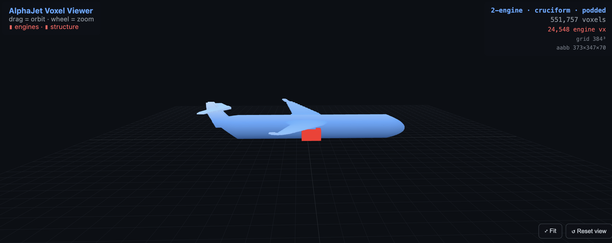

# AlphaJet

A conceptual aircraft designer that evolves a 3D jet from a mission specification using a genetic algorithm coupled with an anatomically-disentangled variational autoencoder. The fitness of every candidate design is computed from a closed-form physics model covering aerodynamics, structures, weights, stability, and volumetric packaging.

<p align="center">
  
</p>

<p align="center">
  
  
  
  
</p>

---

## Overview

The user supplies a mission (target gross mass, payload, range, cruise speed, engine count and thrust, structural areal density) and a hard geometric envelope. AlphaJet then evolves a population of aircraft over a fixed number of generations, streaming each generation's geometry and fitness breakdown to a Three.js viewer in the browser.

The objective is not to replace conceptual design tools such as OpenVSP or SUAVE, but to demonstrate that a compact analytical pipeline — anatomical parameters, deterministic voxelization, and a transparent physics model — is sufficient to drive an interactive evolutionary search across realistic aircraft topologies.

---

## Key contributions

**1. Anatomy-disentangled latent search.**
Most learned aircraft generators encode geometry into an opaque latent vector. AlphaJet instead trains a 3D VAE whose latent dimensions are tied to interpretable anatomical parameters — span, sweep, taper, fineness ratio, fin geometry, engine placement, and so on. The genetic algorithm then evolves directly in this disentangled space, so every mutation corresponds to a meaningful change in the aircraft rather than a random walk through a black-box manifold.

**2. Topology-protected evolution across five tail configurations.**
Standard GAs collapse onto a single dominant configuration within a few generations. AlphaJet seeds the population round-robin across five distinct tail topologies (conventional, T-tail, cruciform, V-tail, flying-wing) and enforces topology elitism, guaranteeing that each configuration is preserved and improved in parallel. The result is a Pareto-style comparison across topologies in a single run, instead of a single locally optimal shape.

**3. Mount-aware fitness with hard envelope projection.**
Conventional shape generators happily produce aircraft with engines floating in mid-air or stabilizers detached from the fuselage. AlphaJet's fitness function explicitly checks that every component's bounding region intersects the structure it claims to attach to (fuselage, fin, wing pylon), and penalizes floating geometry. At the same time, the user-defined outer envelope and per-engine bounding box are projected onto every individual at every generation, so the evolved design is guaranteed to be both physically connected and dimensionally compliant.

---

## Installation

```bash
git clone https://github.com/BorisKriuk/AlphaJet.git
cd AlphaJet
python -m venv venv
source venv/bin/activate
pip install -r requirements.txt
python app.py
```

Open `http://localhost:5011` and start the evolution from the UI.

The first run trains the AD-VAE on 4,000 synthetic jets (approximately one minute on CPU, seconds on GPU). Trained weights are cached to `advae.pt` and reused on subsequent runs.

---

## Inputs

| Group       | Field                  | Description                                      |
| ----------- | ---------------------- | ------------------------------------------------ |
| Envelope    | L, H, W                | Hard outer bounding box of the aircraft (m)      |
| Envelope    | Engine L, H, W         | Per-engine bounding box (m)                      |
| Mission     | Gross mass target      | Target maximum take-off weight (kg)              |
| Mission     | Payload target         | Optional desired payload (kg)                    |
| Mission     | Required range         | Mission range (km)                               |
| Mission     | Cruise speed           | True airspeed at cruise (m/s)                    |
| Propulsion  | Number of engines      | 0 for automatic selection, or 1 to 4             |
| Propulsion  | Total engine thrust    | Sea-level static thrust (kN)                     |
| Structure   | Areal density          | Skin mass per square meter (CFRP ~14, Al ~18, Ti ~28) |
| Search      | Generations            | GA iteration budget                              |

---

## Pipeline

```
 ┌────────────────┐  25-D anatomy  ┌────────────────┐  voxels  ┌────────────────┐
 │  GA + AD-VAE   │ ───────────── ▶│ analytical 3D  │ ───────▶ │  physics model │
 │   population   │                │   voxelizer    │          │   + fitness    │
 └───────▲────────┘                └────────────────┘          └────────┬───────┘
         │                                                              │
         └────── tournament + topology elites + mutation  ◀─────────────┘
```

1. The initial population is seeded with an equal mix of all five tail topologies.
2. Each genome is decoded into 25 anatomical parameters.
3. The aircraft is voxelized analytically with the user envelope applied.
4. The physics model returns a fitness score and over thirty sub-metrics.
5. Selection uses fitness-, topology-, and diversity-based elites, with stagnation restarts.

---

## Repository layout

```
AlphaJet/
├── app.py            # Flask + Socket.IO server and main run loop
├── evolution.py      # Genetic algorithm: seeding, repair, selection, decoding
├── physics.py        # Drag, range, weights, mounts, stability, fitness aggregation
├── dataset.py        # Parameter ranges and analytical voxelizer
├── advae.py          # Anatomically-Disentangled 3D VAE
├── train.py          # AD-VAE training on synthetic jets
├── templates/        # Three.js front-end
├── docs/
│   └── aircraft.png  # Sample evolved design
├── requirements.txt
└── README.md
```

---

## Live outputs

The browser viewer reports, for the current best individual:

- Voxelized geometry, with structure and engines rendered as separate components.
- A fitness breakdown including L/D, lift coefficient, Mach versus critical Mach, range ratio, wing-root stress, static margin, mount score, and envelope compliance.
- The full set of 25 evolved anatomical parameters.

---

## Roadmap

- Center-of-gravity and payload visualizer overlay.
- Export of evolved geometry to STEP and STL.
- Multi-objective Pareto front across range, payload, and mass.
- Extended mission profile (climb, loiter, dash) beyond cruise.
- Multi-aircraft co-design.

---

## Disclaimer

AlphaJet is a research and educational tool. The physics model is intentionally analytical and lightweight so that the genetic algorithm can run interactively in the browser. The output is not certified for any engineering or operational use.

---

## License

Released under the MIT License. See `LICENSE` for details.

